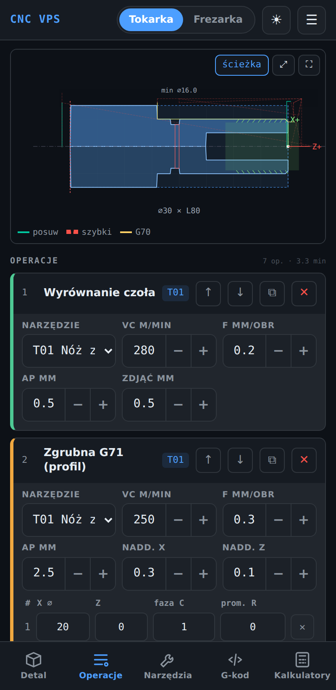
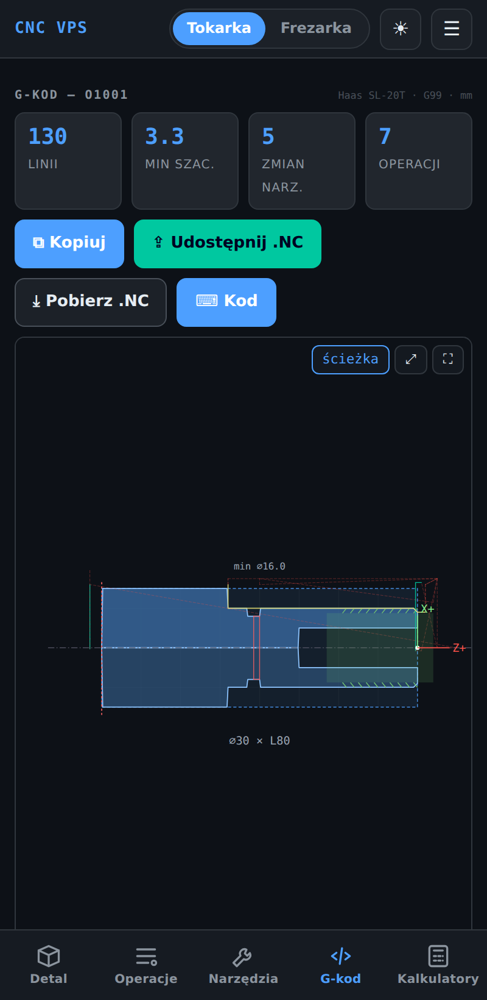
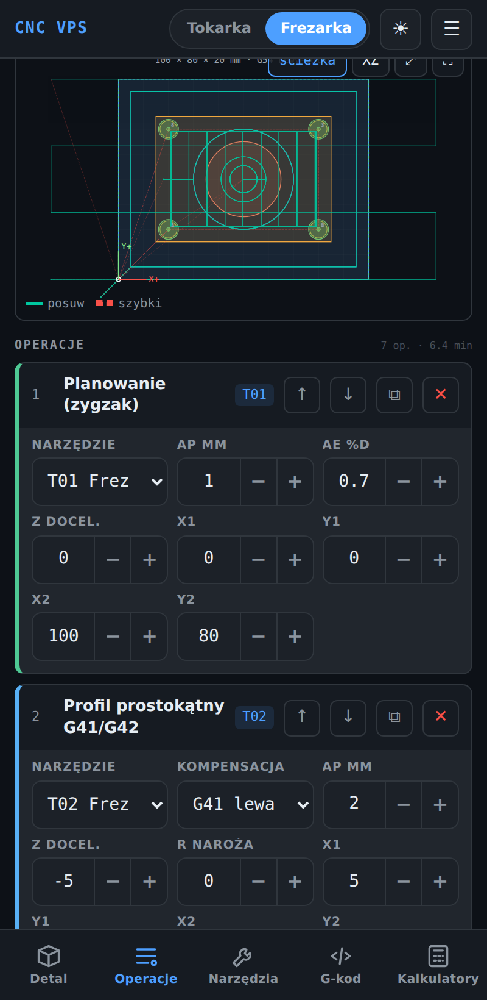
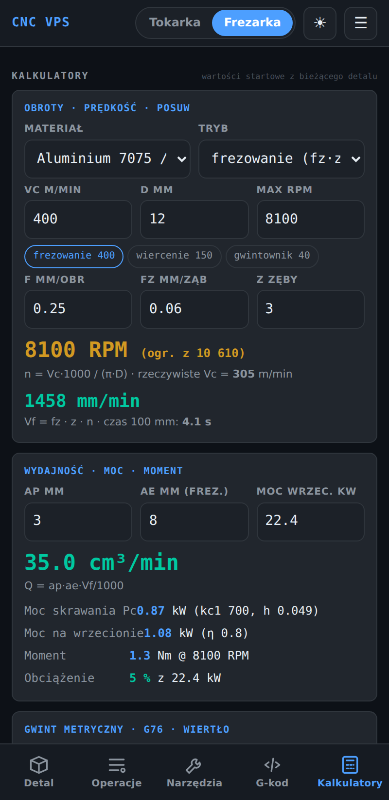

# CNC VPS — Tokarka i Frezarka Haas

Mobilny kalkulator parametrów skrawania i generator G-kodu dla **Haas SL-20T** (tokarka, Classic Control 2006) i **Haas VF** (frezarka). Działa offline jako PWA, buduje się do Androida przez Capacitor.

> ⚠ Wygenerowany program zawsze sprawdź w trybie graficznym maszyny (Graphics) i przejedź pierwszą sztukę ze zmniejszonym posuwem szybkim. Parametry Vc / f / fz są wartościami startowymi — dostosuj je do płytki, mocowania i sztywności.

## Funkcje

**Tokarka (G18, G99 mm/obr, programowanie średnicowe)**
- Czoło, zgrubna **G71 z profilem punktowym** (fazy C i promienie R → G01/G02/G03), wykończenie **G70**, toczenie proste (wiele przejść), stożek, wytaczanie G71 wewnętrzne, rowek **G75** (szerszy niż płytka → wiele wcięć), gwint **G76** zewnętrzny/wewnętrzny (parametry z normy ISO), wiercenie **G83 / G74**, odcinanie z limitem G50.
- Model detalu w płaszczyźnie ZX z odbiciem lustrzanym — symulacja ubytku materiału po każdej operacji, otwory, gwinty, rowki.

**Frezarka (G17, G54, G94 mm/min)**
- Planowanie zygzak, profil G41/G42 z promieniami naroży, okrąg, kieszeń prostokątna z **wejściem rampą 3°**, kieszeń okrągła (helisa + spirala), rowek, wiercenie G81/G83 (siatka lub **PCD**), gwintowanie G84, wytaczanie G85/G76, fazowanie.
- Podgląd XY z geometrią operacji, punkt bazy G54 (9 pozycji), przekrój XZ głębokości.

**Post-procesory (Ustawienia)**
- Wybór postu osobno dla tokarki i frezarki; post steruje kodami, cyklami i formatowaniem — generator nie zna konkretnego sterownika.
- Wbudowane: **Haas VF Classic Control**, **Haas MM BART v2** (odwzorowanie `HaasMM_BARTv2.spm`: N0001+1, bez spacji, G54 w zmianie narzędzia, M29), **Fanuc 0i-M**, **Haas SL-20T Classic Control**, **Fanuc 0i-T**.
- **Import `.spm` z VisualMill / VisualCAD-CAM** — numeracja, znaki komentarza, precyzja, kody ruchu i cykli oraz bloki startu, zmiany narzędzia i końca programu; własne posty zapisują się lokalnie i można je eksportować do JSON.
- Nadpisanie formatu bez ruszania postu: numeracja N (start, krok, zera wiodące), miejsca dziesiętne, spacje w bloku; podgląd przykładowych bloków na żywo.

**Wspólne**
- **Backplot** — parser wygenerowanego G-kodu rysuje ścieżkę narzędzia (posuw / szybki / G70) — weryfikacja generatora niezależna od jego logiki.
- Pan / zoom (mysz, kółko, pinch na telefonie), pełny ekran podglądu.
- Szacowany czas obróbki i liczba zmian narzędzi, ostrzeżenia (G70 bez G71, kieszeń węższa niż frez, Z głębiej niż detal, rampa za stroma…).
- Magazyn narzędzi (12 / 30 pozycji) z presetami dla materiału, 8 materiałów (P/M/K/N/S) z kc1/mc do obliczeń mocy.
- Kalkulatory: RPM / Vc / Vf, wydajność Q, **moc i moment** (Kienzle), gwint metryczny + blok G76 + wiertło pod gwint, **tolerancje ISO 286** (H7/g6… + luz pasowania), stożki (Morse, 1:10…), trójkąt prostokątny, PCD, chropowatość Ra ↔ f.
- Zapis projektów, eksport/import JSON, eksport **.NC** (udostępnianie na Androidzie / pobranie), motyw jasny/ciemny, autosave.

## Zrzuty ekranu

<p>   </p>

## Uruchomienie

```bash
npm install
npm run dev        # http://localhost:5173
npm test           # testy generatorów i kalkulatorów (vitest)
npm run build      # dist/ (PWA)
```

## GitHub Pages (wersja web / PWA)

1. Repo → **Settings → Pages → Source: GitHub Actions**.
2. Każdy push na `main` uruchamia `.github/workflows/deploy.yml` (testy + build + deploy).
3. Adres: `https://<użytkownik>.github.io/<repo>/`. Na telefonie: „Dodaj do ekranu głównego” — aplikacja działa offline.

## Android (Capacitor)

```bash
npm run build
npx cap add android      # raz
npx cap sync android
npx cap open android     # Android Studio → Run
```

Workflow `.github/workflows/android.yml` (ręcznie lub tag `v*`) buduje debug APK jako artefakt.

### Google Play
1. Wygeneruj keystore: `keytool -genkey -v -keystore cncvps.keystore -alias cncvps -keyalg RSA -keysize 2048 -validity 10000`.
2. Dodaj sekrety repo: `KEYSTORE_BASE64` (`base64 -w0 cncvps.keystore`), `KEYSTORE_PASSWORD`, `KEY_ALIAS`, `KEY_PASSWORD`.
3. W `android/app/build.gradle` dodaj `signingConfigs.release` i w workflow krok `./gradlew bundleRelease` → `app-release.aab` → Play Console.
4. `appId` w `capacitor.config.json`: `pl.bartzarzar.cncvps` — zmień przed pierwszą publikacją, bo później nie da się go zmienić.

## Struktura

```
src/core/      logika bez DOM (testowana): materials, calc, tables, lathe, mill, posts, backplot, storage
src/ui/        app (stan + ekrany), preview (SVG), calc-view, settings-view, export
tests/fixtures/ przykładowy .spm do testów importu
tests/         vitest
.github/       deploy (Pages) + android (APK)
```

## Plan rozwoju
- podgląd 3D (bryła obrotowa / bryła frezowana, three.js),
- G72 (czołowy), G92, podprogramy M97/M98, konik/podtrzymka w cyklach,
- edytor postów w aplikacji (własne bloki nagłówka i zmiany narzędzia), import postów Fusion/Mastercam,
- zakładka „Pomiar” — makra Renishaw (G65 P9xxx) do ustawiania bazy i pomiaru,
- własne materiały i płytki z zapisem, import listy narzędzi z CSV,
- symulacja krok po kroku (suwak po liniach G-kodu).
